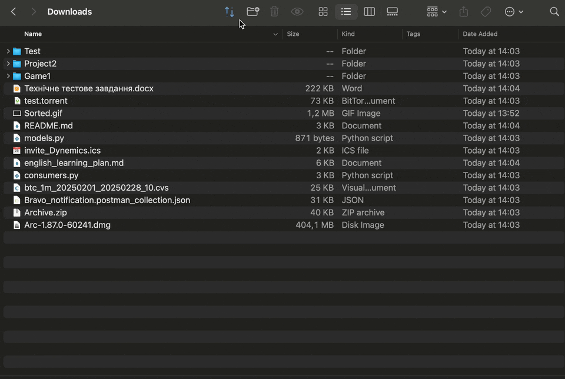

# 📁 Сортувальник Завантажень (Downloads Sorter)

Розумний і елегантний Python-скрипт, який автоматично організовує вашу папку `~/Downloads`.  
Він сортує файли за **типом** (документи, відео, код тощо) та **датою останньої зміни** (сьогодні, тиждень, місяць, старі), використовуючи папки з емодзі для наочності.

## ✨ Можливості

- 📌 Сортує файли за типами: зображення, відео, код, музика, торенти, скріншоти тощо
- 📆 Групує за часом: Сьогодні, Тиждень, Місяць, Старі
- 🗑 Переміщує старі файли до системного кошика (не видаляє назавжди)
- ♻️ Режим скидання: повертає файли назад у `Downloads` для повторного сортування
- 📦 Підтримка `.torrent`, `.dmg`, `.xlsx`, `.json` та інших форматів
- 🧠 Визначає категорії за розширенням файлу
- 🔧 Кросплатформеність: протестовано на macOS та Linux
  


## 🚀 Використання

1. Клонуйте репозиторій:
   ```bash
   git clone https://github.com/RozhkoDmytro/downloads-sorter
   cd downloads-sorter
   ```

2. Запустіть скрипт:
   ```bash
   python3 sorter.py
   ```

📅 Додаткові залежності не потрібні — використовується лише стандартна бібліотека Python.

---

## 🛍 Автоматизація скрипта

### 🕒 Варіант 1: Запуск через `cron` (macOS/Linux)

1. Відкрийте файл crontab:
   ```bash
   crontab -e
   ```

2. Додайте рядок, щоб скрипт виконувався щодня о 18:00:
   ```bash
   0 18 * * * /usr/bin/python3 /Users/YOUR_USERNAME/Downloads/downloads-sorter/sorter.py
   ```

> 🔁 Замініть `YOUR_USERNAME` на своє реальне ім’я користувача в системі.

3. Збережіть і вийдіть. Скрипт буде запускатися у фоновому режимі щодня.

---

### 🎮 Варіант 2: Додати у Finder через Script Editor (тільки macOS)

1. Відкрийте **Script Editor.app**.

2. Вставте код:
   ```applescript
   do shell script "/usr/bin/python3 ~/Downloads/downloads-sorter/sorter.py"
   ```

3. Натисніть `⌘S` (Зберегти):
   - Формат: **Application**
   - Назва: `Sort Downloads`
   - Зберігайте у `/Applications` або іншій зручній папці

4. (Необов’язково) Змініть іконку:
   - Правий клік по `.app` → **Get Info (Інформація)**
   - Перетягніть `.icns` файл у верхній лівий кут вікна з іконкою

5. Додайте у панель Finder:
   - Відкрийте будь-яке вікно Finder
   - Утримуючи `⌘`, перетягніть вашу програму в панель інструментів

---

Тепер ви можете:
- 🔁 Запускати автоматично через `cron`
- 🗂 Запускати вручну одним кліком з Finder

Потрібен значок або `.icns` файл? Я можу допомогти створити його!