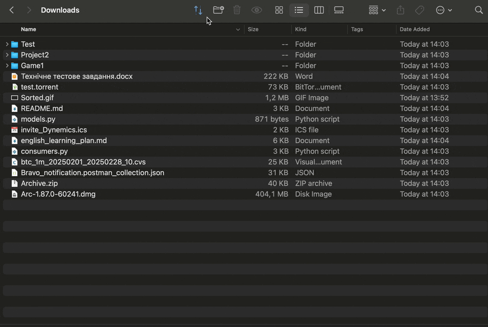

# 📁 Downloads Sorter

A smart and elegant Python script that automatically organizes your `~/Downloads` folder.  
It categorizes files by **type** (documents, videos, code, etc.) and **modification date** (today, week, month, old), using emoji-based folders for clarity and visual appeal.

## ✨ Features

- 📌 Sort files by type: images, videos, code, music, torrents, screenshots, and more
- 📆 Group files by age: Today, Week, Month, Old
- 🗑 Move old files to system Trash (instead of deleting)
- ♻️ Reset mode: restores previously sorted files to re-sort everything from scratch
- 📦 Supports `.torrent`, `.dmg`, `.xlsx`, `.json`, and more
- 🧠 Uses file extension to detect categories accurately
- 🔧 Cross-platform: tested on macOS and Linux



## 🚀 Usage

1. Clone the repository:
   ```bash
   git clone https://github.com/RozhkoDmytro/downloads-sorter
   cd downloads-sorter
   ```

2. Run the script:
   ```bash
   python3 sorter.py
   ```

📅 No dependencies required — uses built-in Python modules only.

---

## 🛍 Automate the script

### 🕒 Option 1: Run with `cron` (macOS/Linux)

1. Open your crontab:
   ```bash
   crontab -e
   ```

2. Add this line to run the script every day at 18:00:
   ```bash
   0 18 * * * /usr/bin/python3 YOUR_PATH/downloads-sorter/sorter.py
   ```

> 🔁 Replace `YOUR_PATH` with your actual macOS username.

3. Save and close. The script will run daily in the background.

---

### 🎮 Option 2: Add to Finder via Script Editor (macOS)

1. Open **Script Editor.app**.

2. Paste this code:
   ```applescript
   do shell script "/usr/bin/python3 ~/downloads-sorter/sorter.py"
   ```

3. Press `⌘S` (Save):
   - Format: **Application**
   - Name: `Sort Downloads`
   - Save it to `/Applications` or your preferred folder.

4. (Optional) Change the icon:
   - Right-click the new `.app` → **Get Info**
   - Drag and drop a `.icns` file onto the icon at the top-left.

5. Add to Finder toolbar:
   - Open any Finder window.
   - Hold `⌘` and drag your new app into the toolbar.

---

Now you can:
- 🔁 Let it run daily via `cron`
- 🗂 Launch with one click from Finder

